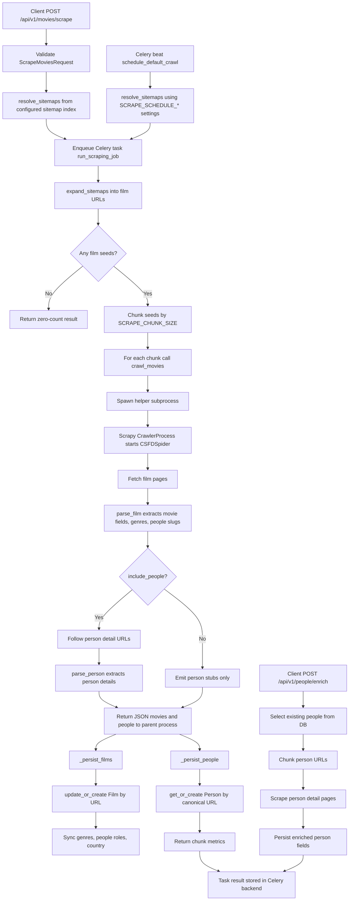

# Scraping Process Overview

This document describes the current CSFD scraping flow in the FastAPI + Celery + Scrapy stack and highlights likely loopholes or weak points found from the implementation.

## Main Entry Points

- Fast film collection trigger: `POST /api/v1/movies/scrape` in `app/api/routes/movies.py`
- Film scrape status polling: `GET /api/v1/movies/scrape/{task_id}` in `app/api/routes/movies.py`
- Slow person enrichment trigger: `POST /api/v1/people/enrich` in `app/api/routes/people.py`
- Person enrichment status polling: `GET /api/v1/people/enrich/{task_id}` in `app/api/routes/people.py`
- Periodic trigger: Celery beat task `tasks.scraping.schedule_default_crawl` in `app/tasks/scraping.py`
- Scrapy helper process: `python -m app.services.csfd_scraper` in `app/services/csfd_scraper.py`
- Sitemap parsing helpers: `app/services/sitemap_loader.py` and `scraper/sitemap_collector.py`

## High-Level Flow



## Human-Readable Flow

The scraping process is now split into two paths: fast film collection and slower person enrichment.

Fast film collection starts either when someone calls the API endpoint `POST /api/v1/movies/scrape`, or when Celery beat runs the scheduled crawl task. In both cases, the system first decides which CSFD sitemap files should be used. It does this from the configured sitemap index and the requested page range, such as `from_page` and `max_pages`.

After the sitemap files are selected, the API does not scrape immediately. It creates a Celery background job and returns a task ID. The client can then use that task ID to check progress through `GET /api/v1/movies/scrape/{task_id}`.

The Celery worker receives the job and opens each selected sitemap. From those sitemap files it collects film URLs. If the request has a `max_films` limit, it stops collecting URLs once that limit is reached. If movie scraping is disabled, or no film URLs are found, the job finishes with zero saved films.

When film URLs are available, the worker splits them into chunks using `SCRAPE_CHUNK_SIZE`. Each chunk is scraped separately. This keeps large jobs more manageable and lets the final task result show which chunks completed or failed.

For every chunk, the worker starts a separate Python helper process. That helper process runs Scrapy. The reason for this extra process is that Scrapy uses Twisted, whose reactor is difficult to restart safely inside a long-running Celery worker. By launching a fresh helper process for each chunk, every crawl gets its own clean Scrapy runtime.

Scrapy then visits each film URL. When it receives a film page, it extracts the main film information: title, original title, year, description, genres, rating, poster URL, country, directors, and actors. Directors and actors are collected from the creator links on the film page.

For each person found on a film page, the scraper immediately emits a small person record, also called a stub. This means the database can still link films to people without crawling every person detail page. This is the default fast path.

If `include_people` is explicitly enabled on the film scrape request, Scrapy can still follow each director and actor link to the person detail page during film collection. That is now treated as the slower compatibility path, not the default behavior.

When the Scrapy helper finishes, it prints the collected movies and people as JSON. The Celery worker reads that JSON and starts saving the results to PostgreSQL.

Films are saved first. For each film, the worker cleans the payload, converts the year and rating into database-friendly values, and either updates an existing film with the same URL or creates a new film. Then it refreshes the film's genres, people links, and country.

People are saved separately. Each person is identified by a canonical CSFD creator URL. If a person already exists, the worker updates basic fields such as name and occupation. If not, it creates a new person row.

At the end of each chunk, the worker records how many films and people were saved. If a chunk fails while crawling, the job records the error for that chunk and continues with the next chunk. When all chunks are done, the task result contains the seed URLs, selected sitemaps, chunk size, total saved counts, and per-chunk details.

Slow person enrichment starts when someone calls `POST /api/v1/people/enrich`. Instead of reading sitemaps, this task reads people that already exist in the database, usually the stubs created during fast film collection. By default it selects only people whose `birth_date` is still empty.

The enrichment worker chunks those person URLs and sends them through the same isolated Scrapy helper process. This time the spider starts directly from person detail URLs, extracts person fields, and saves the enriched data back to the existing person rows. The current database schema supports saving `birth_date`; biography text is scraped but still has no database column.

## Pseudo Code

```text
POST /movies/scrape(payload):
    sitemap_urls = resolve_sitemaps(payload.from_page, payload.max_pages)
    if no sitemap_urls:
        return 404

    task_id = celery.delay(
        run_scraping_job,
        sitemap_urls,
        payload.include_people,
        payload.include_movies,
        payload.max_films,
    )
    return task_id and selected sitemap metadata

schedule_default_crawl():
    sitemap_urls = resolve_sitemaps(
        SCRAPE_SCHEDULE_FROM_PAGE,
        SCRAPE_SCHEDULE_MAX_PAGES,
    )
    if no sitemap_urls:
        return scheduled=false

    enqueue run_scraping_job with SCRAPE_SCHEDULE_* limits

run_scraping_job(sitemap_urls, include_people, include_movies, max_films):
    film_seeds = expand_sitemaps(sitemap_urls, include_movies, max_films)
    if film_seeds is empty:
        return zero-count result

    open database connection
    for chunk in chunks(film_seeds, SCRAPE_CHUNK_SIZE):
        try:
            batch = crawl_movies(
                chunk,
                max_listing_pages=1,
                include_people=include_people,
                request_delay=REQUEST_DELAY,
            )
        except:
            mark chunk failed
            continue

        films_saved = persist batch.movies
        people_saved = persist batch.people
        mark chunk completed

    close database connection
    return totals and chunk details

crawl_movies(start_urls, include_people):
    encode crawl settings as base64 JSON
    run "python -m app.services.csfd_scraper --crawl-payload <payload>"
    parse subprocess stdout as JSON
    return ScrapeBatch(movies, people)

CSFDSpider.parse(response):
    if URL contains "/film/":
        parse_film(response)
    else if listing URL or listing markup:
        parse_listing(response)
    else:
        parse_film(response)

parse_film(response):
    csfd_id = first segment after "/film/"
    skip if already seen in this spider process
    extract title, original title, year, description, genres, rating, poster
    extract director and actor links from creators section
    emit person stubs for discovered creators
    emit movie payload

    if include_people:
        follow each director/actor URL and parse_person

parse_person(response):
    extract slug, name, birth date, biography, occupation
    emit person payload

POST /people/enrich(payload):
    task_id = celery.delay(
        enrich_people_job,
        payload.limit,
        payload.only_missing_birth_date,
    )
    return task_id

enrich_people_job(limit, only_missing_birth_date):
    people = select existing Person rows
    if only_missing_birth_date:
        keep only people where birth_date is empty

    for chunk in chunks(person URLs, SCRAPE_CHUNK_SIZE):
        batch = crawl_people(chunk)
        people_saved = persist batch.people

    return totals and chunk details
```

## Persistence Shape

Film persistence:

- Drops movie payloads without a title or URL.
- Derives `release_year` from the first four digits in the scraped year text.
- Stores `rating` as a float if parseable.
- Uses `Film.update_or_create(url=lookup_url, defaults=data)`.
- Clears and replaces genres when a genres list is present.
- Deletes and recreates film-person links per role.
- Creates country rows by exact scraped country name.

Person persistence:

- Canonicalizes people to `BASE_URL/tvorca/<slug>/`.
- Uses `Person.get_or_create(url=url)`.
- Updates only `name` and `occupation` on existing people.
- Scraped `birth_date` is persisted when it can be parsed from the person page.
- Scraped `bio` is collected by the spider but not persisted because the current `Person` model has no biography field.

## Loopholes And Weak Points

1. `ROBOTSTXT_OBEY` is disabled and defaults are aggressive.
   Scrapy settings use `ROBOTSTXT_OBEY=False`, `AUTOTHROTTLE_ENABLED=False`, `REQUEST_DELAY=0.0`, and `SCRAPY_CONCURRENT_REQUESTS=32`. This can be too aggressive for a target site and may violate crawl expectations unless this is intentionally accepted.

2. No request retry/backoff policy is configured in the app layer.
   Sitemap fetches and Scrapy chunks can fail from temporary network errors. Failed crawl chunks are recorded and skipped, but there is no retry queue or automatic reprocessing of failed seeds.

3. Scrapy helper subprocess has no timeout.
   `subprocess.run(...)` can wait forever if the helper process hangs. A stuck chunk can block a Celery worker slot indefinitely.

4. Sitemap expansion does not normalize film URLs.
   `expand_sitemaps()` keeps every unique URL containing `/film/`. The older standalone collector has `normalize_film_urls()` to collapse base, season, and episode URLs, but the production sitemap loader does not use that logic. This can create duplicate or overly granular crawls for series/episodes.

5. Sitemap expansion is only one level deep.
   `resolve_sitemaps()` reads locations from the configured index. `expand_sitemaps()` then expects those selected URLs to contain film page URLs. If a selected URL is itself another sitemap index, the current production flow will not recursively expand it.

6. URL columns are short for real web URLs.
   `Film.url`, `Person.url`, and `MovieLink.url` are `CharField(max_length=100)`. CSFD film/person URLs can exceed this. The code expands title column capacity at runtime but does not do the same for URL columns.

7. `Film.update_or_create(url=...)` relies on a non-unique field.
   The model does not declare `Film.url` as unique. If duplicate rows already exist or concurrent tasks persist the same URL, update-or-create behavior may be ambiguous or race-prone.

8. A person can have only one role per film.
   `PersonInFilm.unique_together = (("films", "persons"),)` prevents storing the same person as both actor and director for the same film. The `role` field is not part of the uniqueness constraint.

9. Person biography is scraped but discarded.
   `parse_person()` extracts `bio`, but the current database model has no biography column.

10. Person stubs and full person pages can conflict in role naming.
    Film pages emit stubs with role-based occupation. Detail page parsing also emits an occupation based on the callback role. For people appearing in multiple roles across chunks, the last update can overwrite occupation with a single value.

11. Listing pagination has an off-by-one interpretation.
    In `parse_listing()`, `max_listing_pages=1` still allows the first listing page plus one `next` page because the counter increments after processing the current page. Current sitemap-driven jobs usually pass film detail URLs, so this mainly matters if listing URLs are used later.

12. Partial success is visible but not promoted to task failure.
    A job can return `SUCCESS` even if some chunks failed. The failure is only inside `chunk_details`, so callers must inspect the result payload instead of relying only on Celery state.

13. Fetch fallback can disable SSL verification.
    `scraper/sitemap_collector.py` retries with an unverified SSL context when normal fetching fails. That is useful for research scripts, but it weakens transport validation if used in production paths through `sitemap_loader`.

14. API protects sitemap selection, but the Celery task accepts arbitrary sitemap URLs.
    The public API resolves from configured `SITEMAP_INDEX_URL`, but `run_scraping_job` itself accepts any `sitemap_urls` passed to Celery. If an internal caller or exposed broker can enqueue arbitrary jobs, it can fetch unexpected URLs.

## Suggested Hardening Priorities

1. Enable crawl politeness: obey robots where required, set a non-zero request delay, and enable AutoThrottle.
2. Add a timeout around the scraper subprocess and include failed seeds in task results.
3. Reuse `normalize_film_urls()` or equivalent logic inside `expand_sitemaps()`.
4. Increase URL column lengths and add unique constraints/indexes for canonical `Film.url` and `Person.url`.
5. Add a biography field if person biographies are useful enough to keep.
6. Change `PersonInFilm` uniqueness to include `role` if multiple roles per person/film matter.
7. Make partial chunk failures easier to detect at the API level, for example with `status: completed_with_errors`.
8. Avoid SSL verification fallback in production sitemap fetching, or make it explicitly opt-in.

## Source Files Reviewed

- `app/api/routes/movies.py`
- `app/tasks/scraping.py`
- `app/services/csfd_scraper.py`
- `app/services/sitemap_loader.py`
- `scraper/sitemap_collector.py`
- `app/schemas/scraping.py`
- `app/core/config.py`
- `app/core/celery_app.py`
- `app/models/entities.py`
- `scraper/test_sitemap_collector.py`
- `app/tests/test_api_smoke.py`
